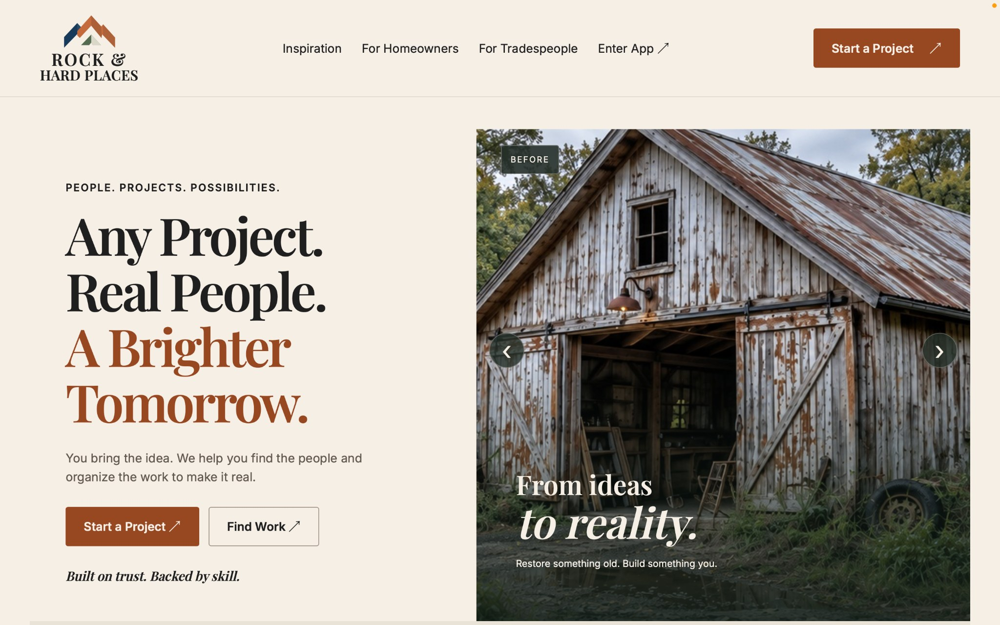

# Rock & Hard Places

**People. Projects. Possibilities.**

Rock & Hard Places is a full-stack project workspace that helps homeowners turn construction and remodeling ideas into organized work with tradespeople. It brings project planning, people, bids, tasks, messages, and progress into one place.



## The problem

A home project can begin with a simple idea, then scatter across notes, texts, contractor quotes, and unfinished task lists. Homeowners need a clearer way to define the work and see who is responsible for each step. Tradespeople need enough context to find relevant opportunities and submit a proposal for a specific scope.

## What the app does

- **Plan a project:** Create a project manually or review a guided project plan with suggested tasks and trades. The homeowner decides what to keep before anything is saved.
- **Organize the work:** Break a project into tasks and subtasks, identify required trades, assign people, and track progress through review and completion.
- **Connect with tradespeople:** Browse professional profiles, qualifications, portfolios, and work opportunities; compare candidates and build a project team.
- **Manage proposals:** Tradespeople can bid on relevant scopes, while homeowners can review and accept bids within the project workspace.
- **Keep the conversation together:** Project conversations, reviews, and portfolio stories give participants more context than a disconnected list of contacts.

## What makes it different

I came to software development after working as a journeyman carpenter and maintenance supervisor. Rock & Hard Places is designed around the way construction work is actually scoped and handed off: a project has distinct tasks, each task may need a different trade, and the team changes as the work moves forward. The product combines finding people with managing the project after that first connection.

The guided Project Builder is advisory. It can suggest a scope and relevant trades, but a homeowner reviews the result, resolves trade choices against the app's catalog, and explicitly creates the project. Manual project creation remains available without the AI service.

## Tech stack

| Layer | Technology |
| --- | --- |
| Frontend | React, TypeScript, Vite, React Router, TanStack Query, CSS |
| Backend | Java 17, Spring Boot 3.5, Spring Web, Spring Data JPA, Jakarta Validation |
| Data | SQLite |
| Optional guided planning | Google Gen AI Java SDK and Gemini API, called from the server |
| Testing | JUnit / Spring Boot tests, frontend Node tests, Playwright |

## Run locally

You need **Java 17**, **Node.js 22.12+**, and npm. From the repository root, start the backend:

```bash
./mvnw spring-boot:run
```

In a second terminal, start the frontend:

```bash
cd frontend
npm ci
npm run dev
```

Open the local URL printed by Vite. The development server proxies `/api` requests to Spring Boot on `localhost:8080`. The SQLite database is configured at `./rhp.sqlite` by default.

For optional AI planning, set `GEMINI_API_KEY` in the backend process environment. Keep the key out of the frontend and out of Git. The app starts without it; manual project creation does not require it. Provider quotas can make guided planning unavailable.

## Current scope

This repository is a **single-presenter demo**, with a server-controlled demo account switcher for homeowner and tradesperson views. It does not yet provide independent user sessions or production authentication. The Vite frontend runs separately for local development; packaging it into the Spring Boot deployment remains an integration step. Some media and account workflows are demo-specific, so this should be treated as a portfolio prototype rather than a live marketplace.

## Project structure

- `frontend/` — React application, UI features, API client, and browser tests
- `src/main/java/com/rockandhardplaces/` — Spring Boot API and domain workflows
- `src/main/resources/` — SQLite schema and application configuration
- `docs/` — design, workflow, audit, and implementation notes

## Why I built it

My background in the trades taught me how much planning, communication, and trust matter after a project is posted. This project lets me bring that field experience into a full-stack application and keep building toward tools that serve the people doing the work.
